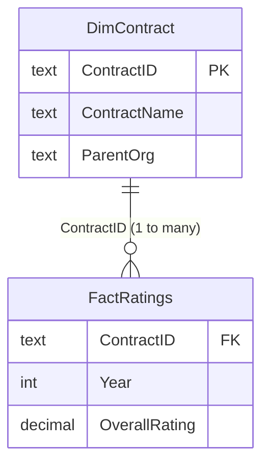

# Medicare Advantage Star Ratings Analytics

CMS Medicare Advantage / Part D star ratings, 2024 to 2025, analyzed in **T-SQL (SQL Server)** and **Power BI**.
Built by a licensed Medicare agent who sells these plans and wanted to see the numbers behind them.

  

## 1. Executive Summary & Business Context

Plans rated 4+ stars earn quality bonus payments, so a drop below 4 is a direct revenue hit for the carrier and a
plan-stability risk for members. This project answers three questions: which contracts and parent organizations
improved, which fell below the 4-star line, and which left the ratings file entirely.

Commercial relevance: star ratings drive carrier revenue (bonus payments), member retention, and which plans an agent
can confidently recommend. Tracking movement year over year is a core workflow for plan-performance and
network-strategy teams.

## 2. Data Architecture & Schema

**Source:** CMS Part C and D Star Ratings summary files for 2024 and 2025, imported into the `CMS_Stars` database on
SQL Server Express as `summary_2024`, `summary_2025` and `domain_2025`. Raw files are not committed; see
[`data/README.md`](data/README.md) for download links and layout.

Two views reshape the imports into a star schema ([`queries/00_setup_views.sql`](queries/00_setup_views.sql)):

| Object | Type | Grain / key | Notes |
|---|---|---|---|
| `FactRatings` | view | one row per `ContractID` per `Year` | `OverallRating` is `DECIMAL(3,1)`; CMS text ("Plan too new to be measured", "Not Applicable") becomes NULL |
| `DimContract` | view | one row per `ContractID` (890 contracts) | `ContractName`, `ParentOrg`; 2025 values preferred, 2024 as fallback |

The Power BI model mirrors this: `DimContract[ContractID]` 1-to-many `FactRatings[ContractID]`, single direction.
`DimContract` also carries the calculated `At-Risk Flag`.

## 3. Key Technical Implementations

### T-SQL ([`queries/`](queries/))

Twelve drills in [`drill-set-1.sql`](queries/drill-set-1.sql) plus a reconciliation script. Each was run against the real
CMS data and the result screenshot shows the query, grid and row count.

| Drill | Business metric | Technique | Rows |
|---|---|---|---|
| A1 | Contracts rated in both years, YoY change | `INNER JOIN` | 756 |
| A2 | 2024 contracts missing from 2025 | anti-join (`NOT EXISTS`) | 101 |
| A3 | Parent-org YoY change | join + `GROUP BY` | 180 |
| A4 | New 2025 contracts | anti-join (`NOT EXISTS`) | 33 |
| B1 | 2025 rating distribution | `GROUP BY`, `SUM() OVER ()` window | 7 |
| B2 | Star bands with 20+ contracts | `HAVING` | 5 |
| B3 | Top 10 parent orgs by 2025 average | `TOP`, `GROUP BY` | 10 |
| B4 | 2024 to 2025 band migration | self-join, `GROUP BY` | 25 |
| C1 | Top contract per parent org | CTE, `ROW_NUMBER() OVER (PARTITION BY ...)` | 141 |
| C2 | Unrated contracts by parent org | CTE, `CASE`, `NULLIF` | 108 |
| C3 | Every rating drop, categorized | CTE, `CASE` | 165 |
| C4 | At-risk flag for contracts rated in both years | chained CTEs, `CASE` | 477 |

**Reconciliation** ([`reconciliation-242.sql`](queries/reconciliation-242.sql)): a NULL-aware `LEFT JOIN` accounts for
every one of the 242 contracts at 4+ stars in 2024, so the statuses sum back to the starting population
(173 still 4+, 56 dropped, 9 not in the 2025 file, 4 unrated). Index of result screenshots: [`queries/README.md`](queries/README.md).

### Power BI / DAX ([`powerbi/`](powerbi/))

- **Measures** (table `_Measures`, full definitions in [`powerbi/dax-measures.md`](powerbi/dax-measures.md)):
  `Avg Star Rating`, `Rated Contracts`, `Unrated Contracts`, `Contracts 4+ Stars`, `% Contracts 4+ Stars`,
  `Rating YoY Change`, `Contract YoY Change`, `Dropped Below 4 Count`.
- **Calculated columns:** `Star Band` and `Star Band Sort` on `FactRatings`; `At-Risk Flag` on `DimContract`.
- **Report page hierarchy** ([`layout-spec.md`](powerbi/layout-spec.md)): 1. Rating Distribution -> 2. Year-over-Year
  Movers -> 3. At-Risk Monitoring (overview, then change, then exceptions).

## 4. Visuals / Deliverables

**Rating Distribution** - where contracts land, and which organizations lead.

**Year-over-Year Movers** - who gained and who lost the most, 2024 to 2025.

**At-Risk Monitoring** - steep drops and sub-3-star contracts.

**Reconciliation of the 242 contracts**

**Adding or refreshing exports:** capture each Power BI page at 100% zoom (or *File > Export*), save the PNG into
`powerbi/screenshots/` for dashboard pages or `docs/images/` for anything else (for example
`docs/images/dashboard_overview.png`), keep the numeric-prefix naming, and reference it with ``.
SSMS result screenshots go in `queries/results/`.

Deliverable: [`powerbi/medicare-star-ratings-dashboard.pbix`](powerbi/medicare-star-ratings-dashboard.pbix)
(dark and light themes alongside it).

## 5. Insights & Actionable Takeaways

1. **The 4-star bonus line is getting harder to hold.** 44.4% of rated contracts were at 4+ stars in 2024; in 2025 it is
   **40.9%** (213 of 521). Average rating slipped from 3.68 to **3.65**.
   *Action:* treat 4-star status as a risk to manage, not a given.
2. **56 of the 242 contracts (23%) at 4+ stars in 2024 fell below 4 in 2025**, each a bonus-payment loss.
   173 held on, 9 left the ratings file, 4 went unrated.
   *Action:* focus retention work on contracts that sat just above the line.
3. **Improvers and decliners split by scale.** Kaiser (+0.50), Alignment Healthcare (+0.40) and Centene (+0.26) lead
   among parent orgs with 5+ rated contracts; UnitedHealth (-0.18) and Humana (-0.28) went the other way.
   *Action:* benchmark against the improvers when assessing carrier quality trends.
4. **33 contracts dropped a full star or more**, and Humana (6) and UnitedHealth (5) account for a third of them.
   Separately, only 521 of 789 contracts in the 2025 file have a score; Devoted Health has 54.5% of its contracts unrated.
   *Action:* report unrated contracts alongside averages so coverage gaps stay visible.

The query behind every number: [`docs/findings.md`](docs/findings.md).

## 6. Setup & Reproduction Guide

**Requirements:** SQL Server Express + SSMS (or `sqlcmd`); Power BI Desktop (Windows) for the dashboard.

1. **Clone:** `git clone https://github.com/Haitham1111/medicare-enrollment-analytics.git`
2. **Get the data.** Download the 2024 and 2025 Part C and D Star Ratings files from CMS (links in
   [`data/README.md`](data/README.md)) into `data/raw/` (git-ignored).
3. **Import** the summary and domain sheets into a database named `CMS_Stars` as `summary_2024`, `summary_2025`,
   `domain_2025`.
4. **Build the views:** run [`queries/00_setup_views.sql`](queries/00_setup_views.sql) once.
5. **Run the analysis:** run [`queries/drill-set-1.sql`](queries/drill-set-1.sql) and
   [`queries/reconciliation-242.sql`](queries/reconciliation-242.sql), or from the command line:
   `sqlcmd -S .\SQLEXPRESS -C -d CMS_Stars -i queries\drill-set-1.sql`
6. **Open the dashboard:** open the `.pbix` in Power BI Desktop. To rebuild from scratch, follow
   [`powerbi/build-guide.md`](powerbi/build-guide.md), then import `powerbi/medicare-theme-dark.json` via
   *View > Themes > Browse for themes*.

**Limitations**
- CMS publishes text instead of a score for some contracts. These are treated as NULL / unrated, never as zero, and are counted separately.
- Parent-org averages are simple averages across rated contracts, not enrollment-weighted.
- The dashboard "Steep drops" card shows 28 while drill C3 counts 33: the dashboard flag checks sub-3 first, and 5 of the 33 fell below 3 stars (see `docs/findings.md`).

## Author

**Haitham Saleh** - Licensed Medicare insurance agent (top producer) transitioning into healthcare data analytics.
Microsoft Certified: Power BI Data Analyst Associate (PL-300).

- LinkedIn: https://www.linkedin.com/in/haitham-saleh-8a1a12206
- GitHub: https://github.com/Haitham1111
