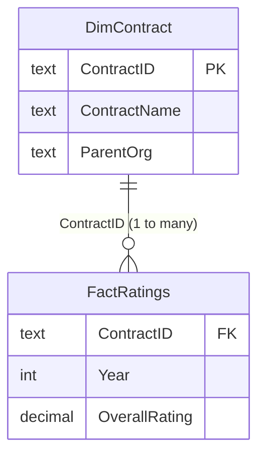
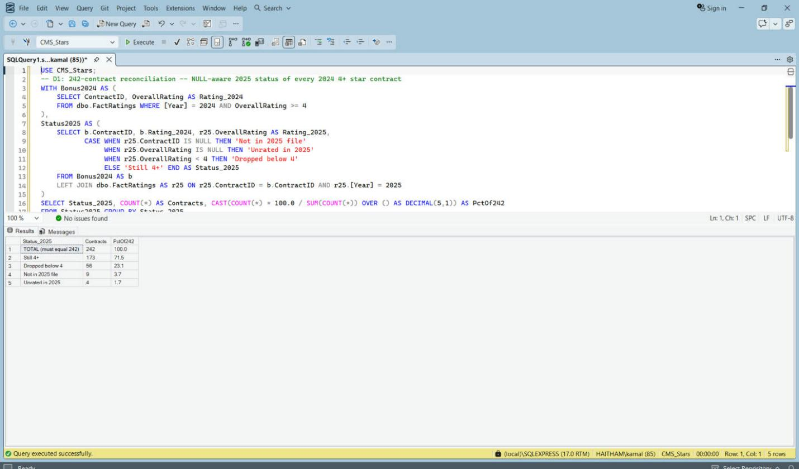
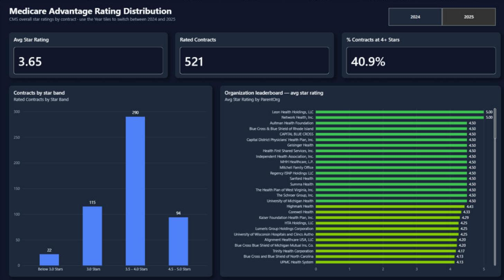
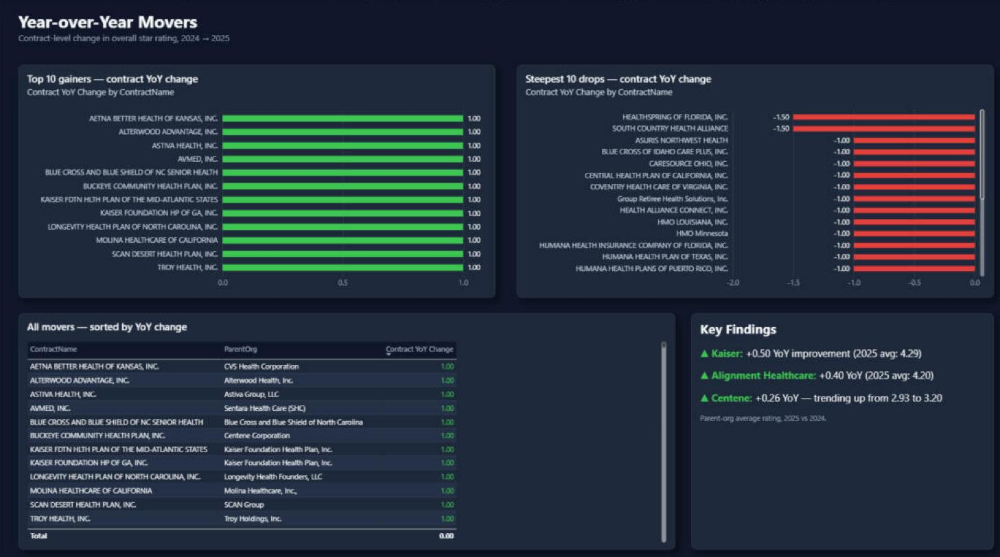
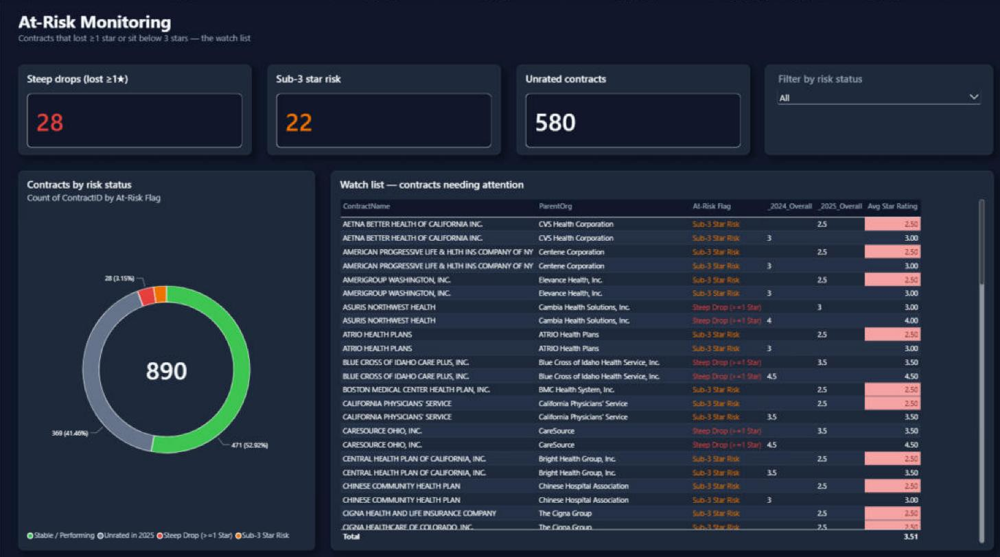

# Medicare Advantage Star Ratings Analytics

CMS Medicare Advantage / Part D star ratings, 2024 to 2025, analyzed in **SQL Server** and
**Power BI**. Built by a licensed Medicare agent who sells these plans and wanted to see the
numbers behind them.

## 1. Business Problem & Executive Summary

Plans rated 4+ stars earn quality bonus payments, so a drop below 4 is a direct revenue hit
for the carrier and a plan-stability risk for members. This project answers: which contracts
and parent organizations improved, which fell below the 4-star line, and which left the
ratings file entirely.

- **The 4-star bonus line is getting harder to hold.** 44.4% of rated contracts were
  at 4+ stars in 2024; in 2025 it's **40.9%** (213 of 521). Average rating slipped
  from 3.68 to **3.65**.
- **Of the 242 contracts at 4+ stars in 2024, 56 (23%) fell below 4** in 2025 -
  a bonus-payment loss for each. 173 held on, 9 left the ratings file, 4 went unrated.
- **Kaiser (+0.50), Alignment Healthcare (+0.40) and Centene (+0.26)** are the top
  three improvers among parent orgs with 5+ rated contracts. Kaiser now averages 4.29.
  The two biggest carriers went the other way: UnitedHealth -0.18, Humana -0.28.
- **33 contracts dropped a full star or more**; Humana (6) and UnitedHealth (5)
  account for a third of them.
- **Rating coverage is a story of its own:** only 521 of 789 contracts in the 2025
  file have a score. Devoted Health has 54.5% of its contracts unrated.

Full write-up with the query behind every number: [`docs/findings.md`](docs/findings.md).

## 2. Data Architecture & Relational Schema

Source: CMS Part C and D Star Ratings summary files for 2024 and 2025, imported into the
`CMS_Stars` database on SQL Server Express as `summary_2024`, `summary_2025` and
`domain_2025`. Two views reshape them into a star schema, built by
[`queries/00_setup_views.sql`](queries/00_setup_views.sql). The Power BI model uses the same
two tables.

| Object | Type | Grain / key | Notes |
|---|---|---|---|
| `FactRatings` | view | one row per `ContractID` per `Year` | `OverallRating` is `DECIMAL(3,1)`; CMS text ("Plan too new to be measured", "Not Applicable") becomes NULL |
| `DimContract` | view | one row per `ContractID` (890 contracts) | `ContractName`, `ParentOrg`; 2025 values preferred, 2024 as fallback |



In Power BI the relationship is `DimContract[ContractID]` 1 to many `FactRatings[ContractID]`,
single direction. `DimContract` also carries the calculated `At-Risk Flag`; measures live in
`_Measures` ([`powerbi/dax-measures.md`](powerbi/dax-measures.md)).

## 3. Key Business Metrics & SQL Proofs

Twelve drills in [`queries/drill-set-1.sql`](queries/drill-set-1.sql) plus a NULL-aware
reconciliation in [`queries/reconciliation-242.sql`](queries/reconciliation-242.sql). Each
was run against the real CMS data; the result screenshot shows the query, grid and row count.
Row counts were re-checked on SQL Server Express and match.

| Drill | Business metric | Technique | Rows | Result |
|---|---|---|---|---|
| A1 | Contracts rated in both years, YoY change | `INNER JOIN` | 756 | [screenshot](queries/results/A1_2024_vs_2025_inner_join.png) |
| A2 | 2024 contracts missing from 2025 | anti-join (`NOT EXISTS`) | 101 | [screenshot](queries/results/A2_contract_gaps_anti_join.png) |
| A3 | Parent-org YoY change | join + `GROUP BY` | 180 | [screenshot](queries/results/A3_parent_org_yoy_rollup.png) |
| A4 | New 2025 contracts | anti-join (`NOT EXISTS`) | 33 | [screenshot](queries/results/A4_new_entrants_join.png) |
| B1 | 2025 rating distribution | `GROUP BY`, `SUM() OVER ()` | 7 | [screenshot](queries/results/B1_rating_distribution_2025.png) |
| B2 | Star bands with 20+ contracts | `HAVING` | 5 | [screenshot](queries/results/B2_star_band_distribution_having.png) |
| B3 | Top 10 parent orgs by 2025 average | `TOP`, `GROUP BY` | 10 | [screenshot](queries/results/B3_parent_org_avg_rating_top_10.png) |
| B4 | 2024 to 2025 band migration | self-join, `GROUP BY` | 25 | [screenshot](queries/results/B4_yoy_band_migration.png) |
| C1 | Top contract per parent org | CTE, `ROW_NUMBER() OVER (PARTITION BY ...)` | 141 | [screenshot](queries/results/C1_cte_ranked_contracts_per_org.png) |
| C2 | Unrated contracts by parent org | CTE, `CASE`, `NULLIF` | 108 | [screenshot](queries/results/C2_cte_unrated_by_parent_org.png) |
| C3 | Every rating drop, categorized | CTE, `CASE` | 165 | [screenshot](queries/results/C3_cte_rating_drop_detection.png) |
| C4 | At-risk flag for contracts rated in both years | CTEs, `CASE` | 477 | [screenshot](queries/results/C4_cte_full_at_risk_classification.png) |
| Recon | Status of the 242 contracts at 4+ stars in 2024 | `LEFT JOIN` + explicit NULL handling | 5 | [screenshot](queries/results/D1_reconciliation_242.png) |

Reconciliation result (statuses total 242):

| 2025 status | Contracts |
|---|---|
| Still 4+ | 173 |
| Dropped below 4 | 56 |
| Not in 2025 file | 9 |
| Unrated in 2025 | 4 |

Preview:



Each number in the executive summary is traced to its query in
[`docs/findings.md`](docs/findings.md). Index of result files: [`queries/README.md`](queries/README.md).

## 4. High-Resolution Dashboard Screenshots

Three pages, dark theme, star-rating color rules (green >= 4.5 to red < 3.0).

**Rating Distribution** - where contracts land, and which organizations lead.



**Year-over-Year Movers** - who gained and who lost the most, 2024 to 2025.



**At-Risk Monitoring** - steep drops and sub-3-star contracts.



## 5. How to Download and Run

**Dashboard (.pbix)**
1. Download [`powerbi/medicare-star-ratings-dashboard.pbix`](powerbi/medicare-star-ratings-dashboard.pbix)
   (on GitHub: open the file, then the download icon, or clone the repo).
2. Open it in **Power BI Desktop** (Windows). The data model and DAX are inside the file.
3. To rebuild from scratch, follow [`powerbi/build-guide.md`](powerbi/build-guide.md),
   [`powerbi/dax-measures.md`](powerbi/dax-measures.md) and
   [`powerbi/layout-spec.md`](powerbi/layout-spec.md), then import
   `powerbi/medicare-theme-dark.json` via **View > Themes > Browse for themes**.

**SQL (SQL Server Express / SSMS)**
1. Download the 2024 and 2025 Part C and D Star Ratings data from CMS and import the
   summary and domain sheets into a database named `CMS_Stars` as `summary_2024`,
   `summary_2025`, `domain_2025`.
2. Run [`queries/00_setup_views.sql`](queries/00_setup_views.sql) once to build the views.
3. Run [`queries/drill-set-1.sql`](queries/drill-set-1.sql) and
   [`queries/reconciliation-242.sql`](queries/reconciliation-242.sql). Command line:
   `sqlcmd -S .\SQLEXPRESS -C -d CMS_Stars -i queries\drill-set-1.sql`

**Data location:** raw CMS files are not committed. Download them into `data/raw/`
(git-ignored); sources and layout are in [`data/README.md`](data/README.md).

**Repo layout**

```
├── queries/    00_setup_views.sql, drill-set-1.sql, reconciliation-242.sql, results/
├── powerbi/    .pbix, theme JSON, DAX measures, layout spec, screenshots/
├── docs/       findings.md (write-up), build-plan.md, phase1-pull-pack.md
├── data/       README.md (where to download the CMS files)
└── sql/templates/   next phase: enrollment-trend query templates
```

## Limitations & Notes

- CMS publishes text instead of a score for some contracts ("Plan too new to be
  measured", "Not enough data available", "Not Applicable"). These are treated as
  **NULL / unrated**, never as zero, and are counted separately.
- Parent-org averages are simple averages across that org's rated contracts -
  not enrollment-weighted.
- Dashboard "Steep drops" shows 28; drill C3 counts 33. The dashboard flag checks sub-3
  first, and 5 of the 33 fell below 3 stars (see `docs/findings.md`).

Tech stack: SQL Server (T-SQL), SSMS, Power BI Desktop, DAX, Power Query.

## Author

**Haitham Saleh** - Licensed Medicare insurance agent (top producer) transitioning into healthcare data analytics. Microsoft Certified: Power BI Data Analyst Associate (PL-300).

- LinkedIn: https://www.linkedin.com/in/haitham-saleh-8a1a12206
- GitHub: https://github.com/Haitham1111
